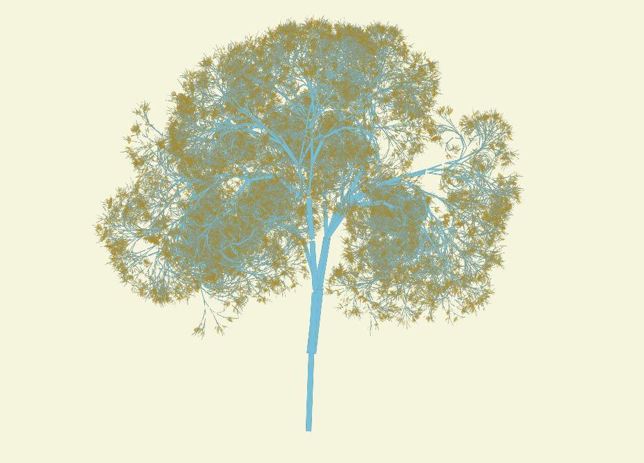
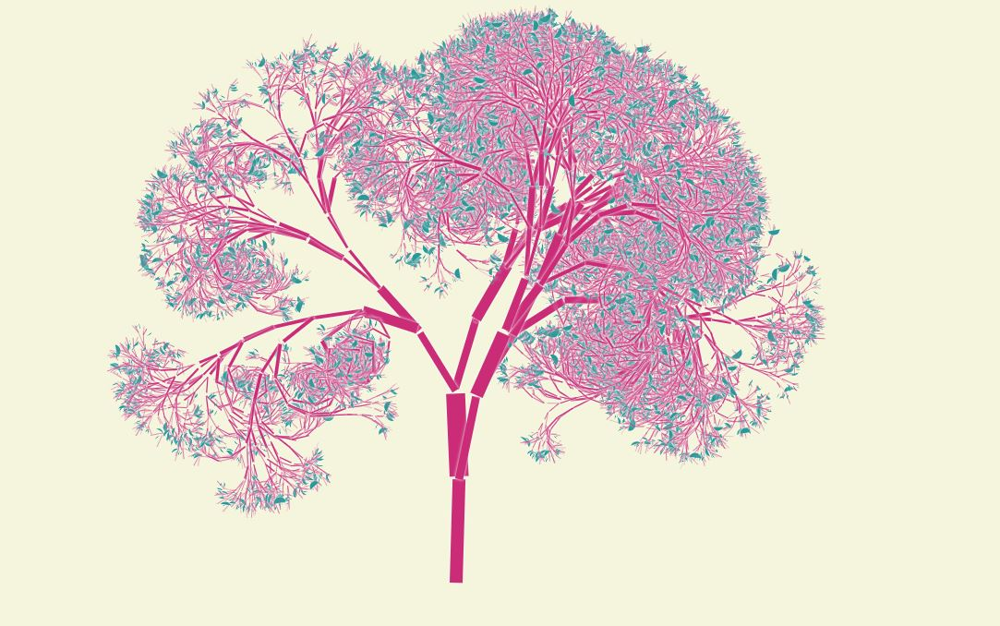
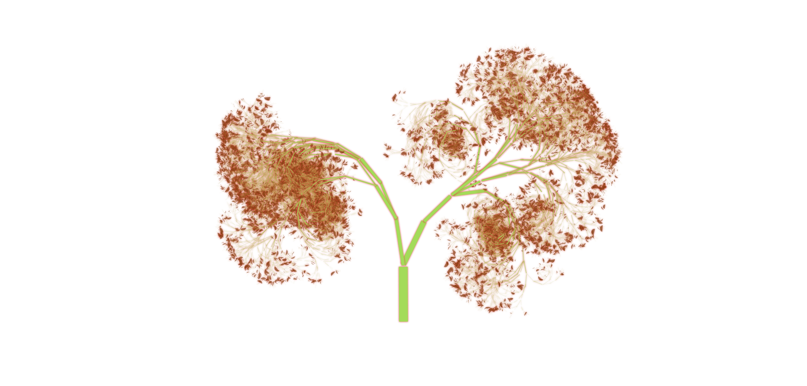
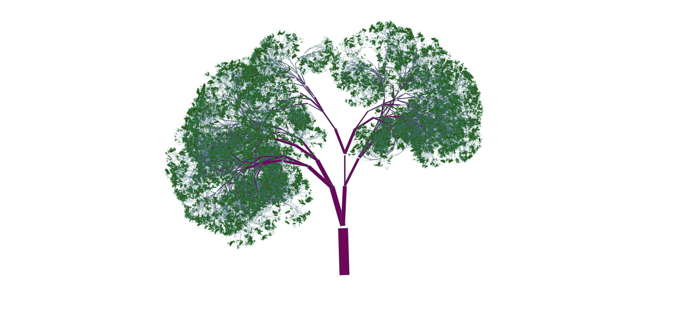
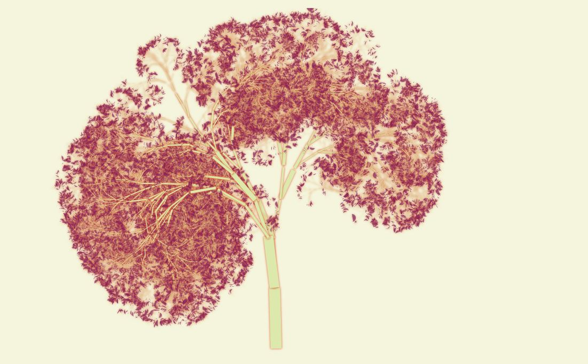
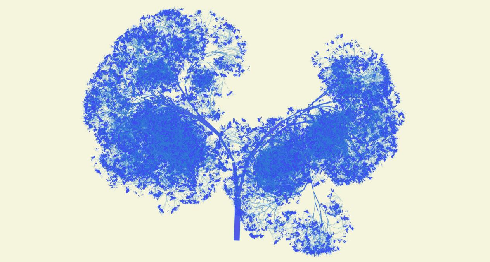

*****
javascript fractal trees
*****

this program using javascript (and vue) will draw a randomised fractal tree on an HTML canvas element in the browser. It's pretty fun :)
########

=====
This is to demonstrate basic use of canvas in HTML, in a recursive context. It's also a good starting point for taking the code, and tinkering with it to create more specific tree patterns. Not all of the trees will look great, but some are pretty good in my opinion.
=====

.. image:: trees/7.JPG
  :width: 400
  :alt: Alternative text
.. image:: trees/8.JPG
  :width: 400
  :alt: Alternative text