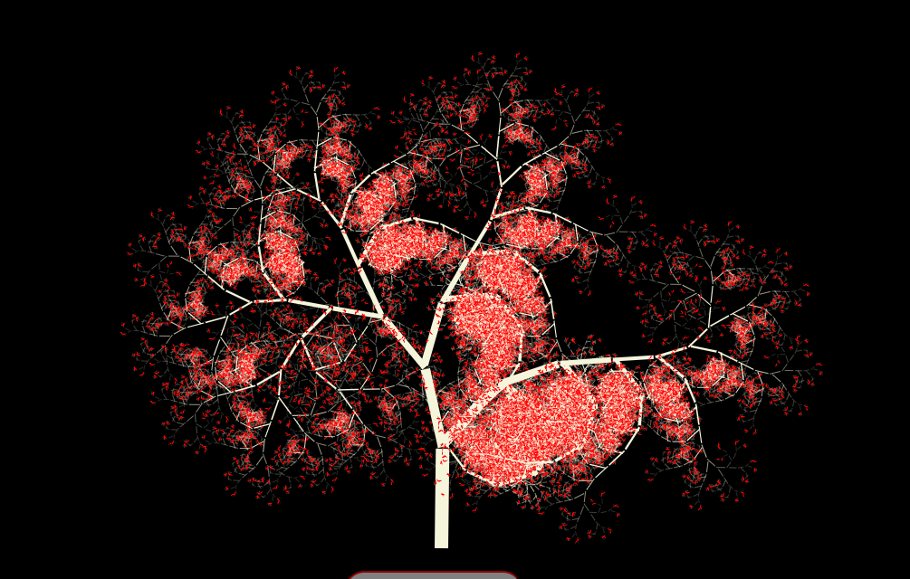

*****
Vue.js fractal tree generator
*****

NOTE: YOU SHOULD INSTEAD GO TO MY REPO TITLED "simple-js-fractal-tree-generator", AS IT IS A MUCH MORE SIMPLIFIED IMPLEMENTATION.

this program (*located within the "fractal-trees" folder*) uses javascript and vue to draw a uniquely generated fractal tree on an HTML canvas element in the browser. It's pretty fun :) Click "new tree" to make a new one! right click to save (which will save the tree's image and shape with no background).
########

=====
This is to demonstrate basic use of canvas in HTML, in a recursive context. It's also a good starting point for taking the code, and tinkering with it to create more specific tree patterns. Not all of the trees will look great, but some are pretty good in my opinion.
=====

.. image:: trees/1.JPG
  :width: 400
  :alt: Alternative text
.. image:: trees/2.JPG
  :width: 400
  :alt: Alternative text
.. image:: trees/3.png
  :width: 400
  :alt: Alternative text
.. image:: trees/4.png
  :width: 400
  :alt: Alternative text
.. image:: trees/5.JPG
  :width: 400
  :alt: Alternative text
.. image:: trees/6.JPG
  :width: 400
  :alt: Alternative text

=====
Here is an example of a bit more of a blatantly fractal-like implementation of the code (removing some of the randomness I had put into the iterations).
=====

"""""
Hope you enjoy
"""""
